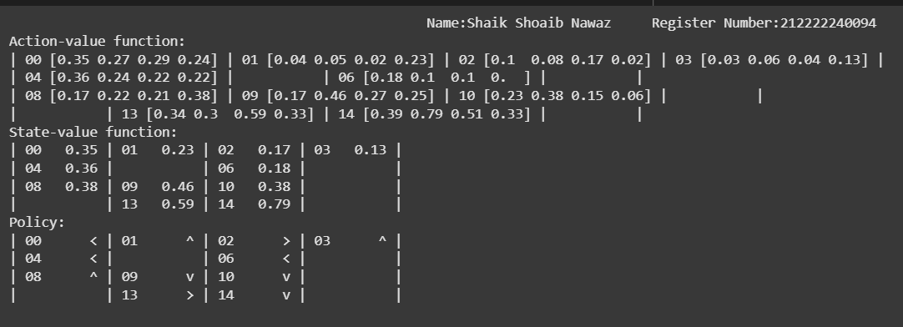

# MONTE CARLO CONTROL ALGORITHM

## AIM
To develop a Python program to find the optimal policy for the given RL environment using the Monte Carlo algorithm.

## PROBLEM STATEMENT
By using Monte Carlo Control algorithm we find the optimal policy for the frozenlake environment based on the experiences(trajectory) from the episodes.

## MONTE CARLO CONTROL ALGORITHM
#### Step1 :
It begins by initializing key variables such as the number of states (ns) and actions (na). A Q-table of size (states × actions) is created to store action-value estimates. The function sets up decaying schedules for the learning rate (alpha) and exploration rate (epsilon) using a decay_schedule function. A discount factor (gamma) is used to calculate the return for each episode. An epsilon-greedy action selection policy is defined to balance exploration and exploitation.

#### Step2:
The training loop runs for a fixed number of episodes. In each episode, a trajectory is generated using the current policy. The trajectory consists of tuples of (state, action, reward, next_state, done). The function then iterates through this trajectory to compute the return G for each state-action pair. If first_visit is True, only the first occurrence of a state-action pair is used. Otherwise, all visits are used (every-visit MC). The Q-value is updated using the formula:
Q(s, a) ← Q(s, a) + α × [G - Q(s, a)],
where G is the discounted return from that step onwards.


#### Step3: 
As training progresses, the function tracks the Q-values and the greedy policy derived from them at each episode. After all episodes are completed, the final state-value function V is computed by taking the maximum Q-value for each state. The learned policy pi is returned as a function that selects the action with the highest Q-value for a given state. Finally, the function returns Q, V, pi, Q_track and pi_track.

## MONTE CARLO CONTROL FUNCTION
```
from tqdm import tqdm
def mc_control(env, gamma=1.0,
               init_alpha=0.5, min_alpha=0.01, alpha_decay_ratio=0.5,
               init_epsilon=1.0, min_epsilon=0.1, epsilon_decay_ratio=0.9,
               n_episodes=3000, max_steps=200, first_visit=True):

    ns, na = env.observation_space.n, env.action_space.n
    discounts = np.logspace(0, max_steps, num=max_steps, base=gamma, endpoint=False)
    alphas = decay_schedule(init_alpha, min_alpha, alpha_decay_ratio, n_episodes)
    epsilons = decay_schedule(init_epsilon, min_epsilon, epsilon_decay_ratio, n_episodes)

    Q = np.zeros((ns, na), dtype=np.float64)
    Q_track = np.zeros((n_episodes, ns, na), dtype=np.float64)
    pi_track = []

    select_action = lambda state, Q, epsilon: np.argmax(Q[state]) if np.random.random() > epsilon else np.random.randint(len(Q[state]))

    for e in tqdm(range(n_episodes), leave=False):
        trajectory = generate_trajectory(select_action, Q, epsilons[e], env, max_steps)
        visited = np.zeros((ns, na), dtype=bool)

        for t, (state, action, reward, _, _) in enumerate(trajectory):
            if visited[state][action] and first_visit:
                continue
            visited[state][action] = True
            n_steps = len(trajectory[t:])
            G = np.sum(discounts[:n_steps] * np.array([x[2] for x in trajectory[t:]]))
            Q[state][action] += alphas[e] * (G - Q[state][action])

        Q_track[e] = Q
        pi_track.append(np.argmax(Q, axis=1))

    V = np.max(Q, axis=1)
    pi = lambda s: np.argmax(Q[s])
    return Q, V, pi, Q_track, pi_track
```
## OUTPUT:
### Name: Shaik Shoaib Nawaz
### Register Number: 212222240094




## RESULT:
Thus, The Python program to find the optimal policy for the given RL environment using  Monte Carlo algorithm is successfully executed.

